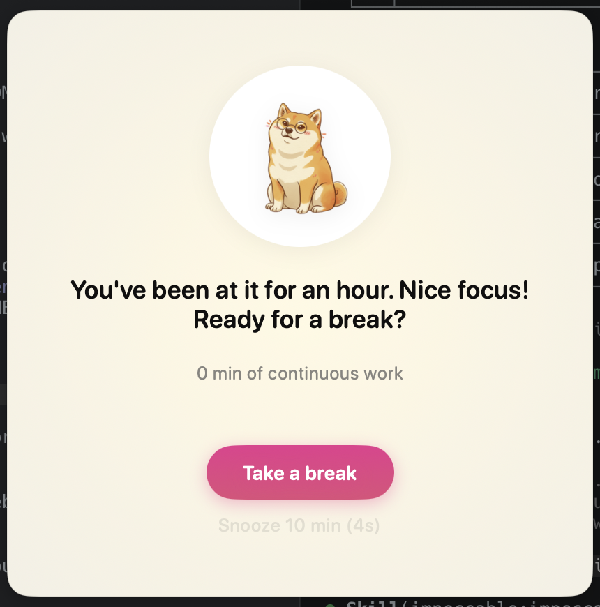

# TakeBreak

A menu bar break reminder for macOS. Nudges you to take a break after an hour of continuous work, with escalating persistence if you keep snoozing.

<p align="center">
  
</p>

## Features

- **Hourly reminders** — after 60 minutes of screen time, a friendly doge appears suggesting a break
- **Snooze** — dismiss with a 10-minute (then 5-minute) snooze; messages escalate the longer you go
- **Grace period** — "Take a break" starts a 2-minute countdown to wrap up, then prompts you to lock your screen
- **Media-aware** — defers alerts while you're on a video call or watching something
- **Pomodoro timers** — start a 25 or 45 minute focused work timer via the menu bar or Cmd+Option+T
- **Screen lock detection** — the timer resets automatically when you lock/unlock your screen

## Install

```bash
brew install --cask peterhartree/takebreak/takebreak
```

Or build from source:

```bash
git clone https://github.com/peterhartree/takebreak.git
cd takebreak
./build.sh
open build/TakeBreak.app
```

## Update

```bash
brew upgrade --cask takebreak
```

## Requirements

macOS 13.0 or later.

## How it works

TakeBreak lives in your menu bar. The icon changes to show your current state:

- **●** — working normally
- **5m** (orange) — five minutes until break reminder
- **●** (red) — break is overdue
- **2:00** (cyan) — grace period countdown

The app resets its timer whenever you lock your screen, so taking a break is as simple as locking up and walking away.

## Note

The app is not codesigned or notarised. On first launch, right-click the app and choose "Open", or run:

```bash
xattr -cr /Applications/TakeBreak.app
```

## Licence

MIT
